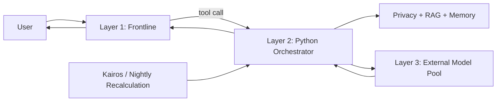

# EPIS

**Emotional Personal Intelligence System**  
*A model-agnostic architecture for persistent personal AI.*

EPIS is an experimental long-term personal AI architecture built around one principle: **models should be replaceable; identity should not be.**

Instead of storing the whole concept of a personal AI inside one model checkpoint, EPIS separates conversational inference from memory, values, identity, routing, privacy, proactive behavior, and long-term learning.

> **Status:** working experimental implementation. The current bottleneck is affordable, high-quality frontline inference on consumer hardware.

## Why EPIS?

Foundation models change quickly. A long-term personal system should not have to lose years of memory, behavior, and context every time its base model changes. EPIS therefore keeps the persistent parts of the system outside the model and treats inference providers as replaceable components.

## Architecture



- **Layer 1 — Frontline:** the user-facing conversational model and EPIS voice.
- **Layer 2 — Orchestrator:** pure Python infrastructure for routing, RAG, file management, privacy filtering, sensors, Kairos triggers, and nightly jobs.
- **Layer 3 — Model Pool:** replaceable external models used for specialized or expensive reasoning tasks.

See [`docs/architecture.md`](docs/architecture.md) for details.

## Implemented areas

- model routing and external API clients
- persistent file-backed context and memory management
- privacy-aware name/place tokenization before external calls
- proactive delivery and Kairos scheduling
- nightly recalculation pipeline
- local model / API backend switching
- web chat interface
- optional WhatsApp bridge
- optional PC/phone/Gadgetbridge sensor integrations
- encryption helpers for private local data
- fine-tuning dataset architecture

## Current limitation

The surrounding architecture is functional, but small models that fit comfortably on consumer GPUs have not consistently met the target for natural conversation, multilingual quality, long-context adherence, personality consistency, and reasoning.

EPIS is therefore being used to evaluate a hybrid approach: local/open-weight frontline models plus selectively routed external reasoning and periodic fine-tuning.

## Quick start

> This repository ships with **no personal data and no credentials**. Monitoring integrations are disabled by default.

```bash
python -m venv .venv
# Windows: .venv\Scripts\activate
# Linux/macOS: source .venv/bin/activate

pip install -r requirements.txt
python scripts/bootstrap_public_data.py
```

Create the runtime environment file:

```bash
# Windows
copy Layer-3\keys.env.example Layer-3\keys.env

# Linux/macOS
cp Layer-3/keys.env.example Layer-3/keys.env
```

Fill only the providers/integrations you intend to use, then start the UI using the scripts in `scripts/` or the project launcher.

The optional WhatsApp bridge has its own Node.js dependencies:

```bash
cd whatsapp_bridge
npm install
```

## Repository safety

The original working project contains extremely private personal-AI data. This public repository deliberately excludes it. The `.gitignore` is designed so that local runtime identity, memory, logs, keys, browser sessions, and sensor databases do not get committed later.

See [`docs/public-sanitization.md`](docs/public-sanitization.md) and [`docs/privacy.md`](docs/privacy.md).

## Fine-tuning

`training/final_dataset.example.jsonl` contains **synthetic examples only**. Real conversational datasets should remain private and curated. The long-term design treats the dataset as portable across base-model upgrades rather than treating any LoRA adapter as the identity itself.

See [`docs/fine-tuning.md`](docs/fine-tuning.md).

## Project structure

```text
EPIS/
├─ Layer-1/             # public identity templates; private runtime data is ignored
├─ Layer-2/src/         # Python orchestration, memory, privacy, sensors, UI
├─ Layer-3/             # environment template only; no keys
├─ docs/                # architecture, privacy and fine-tuning notes
├─ examples/            # synthetic runtime templates
├─ scripts/             # launch/setup/test helpers
├─ training/            # synthetic fine-tuning example
├─ whatsapp_bridge/     # optional WhatsApp Web bridge
├─ main.py
└─ requirements.txt
```

## Security note

This is an experimental personal project, not a production security-reviewed platform. Review network exposure, authentication, third-party API data handling, and local encryption before using it with real personal data.

## License

No open-source license has been selected yet. The source is published for technical evaluation and demonstration.
