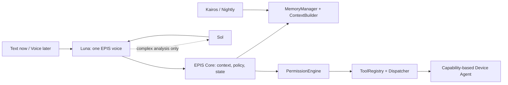

# ADR 0001 — EPIS 0.1 agentic pivot

**Status:** accepted for 0.1

## Decision

EPIS moves incrementally from the legacy Layer-1 JSON-envelope conversation
flow to a text-first agent loop. Luna is the ordinary user-facing model; EPIS
Core is the deterministic policy and execution boundary; Sol is an explicit
heavy-analysis delegate. Identity, memory, privacy, and behavioral state stay
outside model weights.

Luna may suggest a tool but never authorizes it. Core resolves the required
capability to an online device, checks deterministic policy, invokes only a
registered implementation, and returns the observed result to Luna for the
final response. There is no general shell, filesystem, credential, payment,
admin, or delete capability in this MVP.

## Existing-system migration map

| Current area | 0.1 disposition | Reason |
| --- | --- | --- |
| `MemoryManager` | Preserve directly | Encrypted local lifetime data and state stay local. |
| `ContextBuilder` | Preserve directly | It remains Luna's per-turn context retrieval. |
| `PrivacyFilter` | Preserve for Sol/external analysis | `EpisRouter` still pseudonymizes before Layer-3. |
| `EpisRouter` / `api_clients.py` | Preserve for legacy/nightly | The new direct Sol adapter is separate; ordinary local tools never use Sol. |
| `epis_core.py` / `Layer1Engine` | Legacy compatibility | UI, WhatsApp, Kairos formatting and old terminal mode still use it. |
| `Kairos`, proactive delivery, nightly recalculation | Preserve | They continue producing and consuming local state. |
| `sensors.py` | Preserve | Local signal producer; not a remote control mechanism. |
| Old Layer-1 JSON tool protocol | Legacy | It is not the security boundary for new device tools. |

## 0.1 implementation boundary

`Layer-2/src/agentic/` adds a new runtime without changing private storage
formats. The default frontline is direct OpenAI `gpt-5.6-luna`; the specialist
is direct OpenAI `gpt-5.6-sol`. Both use `OPENAI_API_KEY` from the ignored
runtime environment. Luna exposes Sol as a model-service delegation tool only
for complex analysis, coding, planning, and repository review, with at most one
delegation per turn. Sol's output returns to Luna for EPIS-voice synthesis.

Because Luna is cloud inference, `EPIS_LUNA_CONTEXT_MODE=minimal` is the safe
default: it does not collect private memory or sensor context and excludes
private profile/seed material from the identity prompt. Session messages and
requested tool results still go to OpenAI. `local` opts into full context but
does not change the inference endpoint. Sol delegation passes only Luna's
self-contained task through the existing local privacy filter.

The initial Windows registry contains exactly five tools: `open_app`,
`close_app`, `set_volume`, `media_play_pause`, and `get_system_info`.
Permission classes are green (automatic), yellow (confirmation), and red
(explicit confirmation). `close_app` is yellow and sends WM_CLOSE so the
application can offer its normal save dialog; it never force-terminates.

The local `DeviceRegistry` stores only availability/capability metadata. A
`LocalDeviceAgent` registers the current Legion-like machine; private memory,
credentials, file indexes, and project state remain local. `codex.send` is
reserved in the design, but not advertised by the local agent without a real implementation
in 0.1. A future trusted adapter can route “continue” and scoped follow-ups.

## Cloud/device direction

The same interfaces permit a small cloud Core later: cloud state can hold
device availability, task queues, sync cursors, and low-sensitivity metadata.
Each device retains encrypted sensitive state and supplies minimum relevant
context on request. Cloud uses inference APIs and requires no GPU.

Phone client and ElevenLabs STT, turn detection, interruption, and TTS are
separate milestones after text-agent reliability. OpenAI Realtime is not the
planned primary voice layer.

## Risks and mitigations

| Risk | Mitigation |
| --- | --- |
| Model hallucinates an action | Only named registry tools dispatch; observed results are returned. |
| Model broadens a command | Allow-listed app aliases/schemas; no shell tool. |
| App closing loses work | `close_app` asks for confirmation and sends normal WM_CLOSE. |
| Remote device confusion | Routing requires an online capability match and fails closed. |
| Private data reaches external inference | Minimal mode skips private retrieval; typed messages/tool results are still sent. Sol filtering is best effort. |
| Cost grows per action | Luna handles normal interaction; Sol is only an explicit specialist. |

## Follow-up milestones

1. Add `open_url`, battery, media next/previous, and notifications under this policy.
2. Add authenticated device-agent transport, task state, then trusted `codex.send`.
3. Add cloud orchestration/sync with no private-memory replication by default.
4. Add phone/ElevenLabs voice after text-agent reliability is measured.
