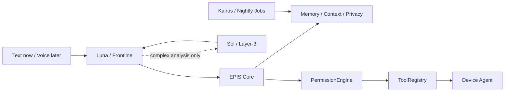

# Architecture

EPIS separates persistent personal state from model inference. EPIS 0.1 keeps
the existing Layer terminology for compatibility while making the execution
boundary explicit: a model suggests work; deterministic Core policy permits
and dispatches it.

## Luna — frontline (Layer-1 compatibility)
The user-facing model is direct OpenAI `gpt-5.6-luna`. It receives a context package containing
relevant memory, identity, values, and current state. Luna can propose a named,
schema-validated tool call; it cannot grant its own permissions. After Core
returns an observed result, Luna delivers the final response in EPIS's single
voice.

## EPIS Core — deterministic orchestrator (Layer-2)
Pure Python infrastructure. It performs context retrieval, device routing,
permissions, tool dispatch, task state, privacy filtering, proactive scheduling,
sensor integration, and nightly processing. It is intentionally not an LLM and
is the security boundary. The 0.1 registry has no arbitrary shell capability.

## Sol — specialist model pool (Layer-3 compatibility)
The default specialist is direct OpenAI `gpt-5.6-sol`, behind a replaceable
interface, for explicitly delegated expensive or specialized
tasks such as reasoning, code, repository analysis, planning, visual analysis,
and nightly synthesis. A normal local tool call does not go to Sol. Core permits
at most one Sol delegation per turn, and the existing privacy layer minimizes
personal data before the external call.

## Identity continuity
The architecture treats models as replaceable computation. Stable values, personality definitions, long-term memory, and approved learning live outside model weights.

## Device and cloud boundary

The 0.1 local `DeviceRegistry` uses capability-based routing. A future always-on
cloud Core may keep low-sensitivity task/sync/device metadata and call inference
APIs without a GPU. Private memory, credentials, file indexes, and project
state remain encrypted and local by default. Phone and ElevenLabs voice I/O are
later milestones, after the text loop is stable.

See [ADR 0001](adr/0001-agentic-pivot.md) for migration details and risks.
