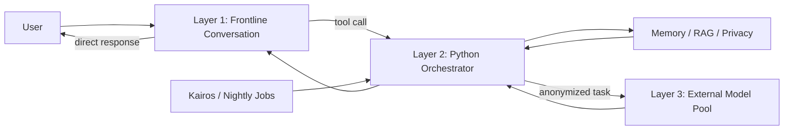

# Architecture

EPIS separates persistent personal state from model inference.

## Layer 1 — Frontline
The user-facing conversational model. It receives a context package containing relevant memory, identity, values, and current state.

## Layer 2 — Orchestrator
Pure Python infrastructure. It performs routing, context retrieval, privacy filtering, tool dispatch, proactive scheduling, sensor integration, and nightly processing. It is intentionally not an LLM.

## Layer 3 — Model pool
Replaceable external models for expensive or specialized tasks such as reasoning, code, visual analysis, and nightly synthesis. The privacy layer is designed to minimize personal data sent outside the local system.

## Identity continuity
The architecture treats models as replaceable computation. Stable values, personality definitions, long-term memory, and approved learning live outside model weights.
