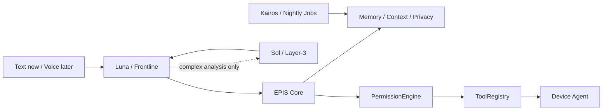

# Architecture

EPIS separates persistent personal state from model inference. EPIS 0.1 keeps
the existing Layer terminology for compatibility while making the execution
boundary explicit: a model suggests work; deterministic Core policy permits
and dispatches it.

## Luna — frontline (Layer-1 compatibility)
The user-facing model is direct OpenAI `gpt-5.6-luna`. It receives a context package containing
shared identity, values, time, current conversation, and requested tool results.
By default, `ContextBuilder.build_minimal()` avoids private retrieval and sensor
reads altogether. Full memory/context is opt-in; `local` names the legacy
context mode, not the location of inference. Luna can propose a named,
schema-validated tool call; it cannot grant its own permissions. After Core
returns an observed result, Luna delivers the final response in EPIS's single
voice.

## EPIS Core — deterministic orchestrator (Layer-2)
Pure Python infrastructure. It performs context retrieval, device routing,
permissions, tool dispatch, task state, privacy filtering, proactive scheduling,
sensor integration, and nightly processing. It is intentionally not an LLM and
is the security boundary. The 0.1 registry has no arbitrary shell capability.
Kairos, proactive delivery and nightly jobs remain on their existing legacy
entry points; the text CLI does not start these services automatically.

## Sol — specialist model pool (Layer-3 compatibility)
The default specialist is direct OpenAI `gpt-5.6-sol`, behind a replaceable
interface, for explicitly delegated expensive or specialized
tasks such as reasoning, supplied code/repository excerpts, and planning.
The 0.1 specialist receives text only and has no repository filesystem tool.
Nightly jobs retain their existing provider routing. A normal local tool call does not go to Sol. Core permits
at most one Sol delegation per turn, and the existing privacy layer minimizes
personal data before the external call.
This filter is best effort, not a guarantee that all sensitive content is removed.
The local reverse mapping restores the specialist answer before Luna sees it.

## Identity continuity
The architecture treats models as replaceable computation. Stable values, personality definitions, long-term memory, and approved learning live outside model weights.

## Device and cloud boundary

The 0.1 local `DeviceRegistry` uses capability-based routing. A future always-on
cloud Core may keep low-sensitivity task/sync/device metadata and call inference
APIs without a GPU. Private memory, credentials, file indexes, and project
state remain encrypted and local by default. Phone and ElevenLabs voice I/O are
later milestones, after the text loop is stable.

See [ADR 0001](adr/0001-agentic-pivot.md) for migration details and risks.

The next local increment is implemented in [ADR 0002](adr/0002-local-device-process.md):
Core dispatches through `DeviceTransport` to an owned stdio worker by default.
It adds command receipts, expiring approvals, worker-side validation, bounded
transport and no automatic replay after uncertain execution. This is a local
process boundary, not a deployed cloud service or an OS privilege sandbox.
The old in-process adapter remains an explicit compatibility option.

[ADR 0003](adr/0003-paired-local-tls.md) adds optional `paired` mode: local mutual
TLS, offline certificate enrollment, signed capability scope, live revocation,
heartbeat and DPAPI-encrypted durable device receipts. It is validated only
between processes on this Windows computer; no off-machine endpoint or cloud
deployment exists. Stdio remains the default. Memory/context and Luna/Sol
interfaces are unchanged.

## Text-loop reliability

Legacy `build_system_prompt()` still produces the original JSON protocol.
The CLI selects `protocol="agentic"` and excludes private profile material in
minimal mode. A narrow adapter unwraps old `type=direct` envelopes as a fallback;
JSON in normal text never authorizes a tool execution.

Every call is validated before permission checks. Confirmation binds to the
specific tool arguments and displayed device. Rejection cancels the remaining
batch; a new request cancels stale pending work. Confirmation rechecks device
availability. All call/result pairs remain complete across pauses, failures
and history trimming. Limits are four Luna responses, up to eight dispatched
calls, and one Sol delegation per turn, carried across confirmations.

An explicit missing/offline device never falls back to a different device.
Cached devices load offline until re-registered. `codex.send` is reserved in
the design but is not advertised by the local agent before an implementation
exists. The registry can represent a future device that owns this capability.

App closing sends normal WM_CLOSE after confirmation rather than terminating
the process. Volume is read back after setting. The global media toggle reports
its target and resulting playback state as unverified.

Validation for the stdio process-boundary increment: 48 tests, actual local worker
read-only round trips, and Windows PowerShell 5.1 startup/inspection/quit.
After explicit user authorization, the process version passed all seven live
model smoke cases: greeting, system info, device listing, battery, action
receipts, unsupported-song handling and Luna -> Sol -> Luna synthesis.
The live test blocked OS mutations and private context retrieval; test
conversations and action receipts were not persisted. Volume also passed a local real-worker check
with its original level restored. Other OS-mutating adapters are mocked in
current regression coverage. Voice, remote network transport, Spotify track selection
and Tauri remain future work. The subsequent paired increment passes 68 tests,
PowerShell startup/inspection/quit and the seven authorized live model smoke
cases over loopback TLS. Paired device receipts intentionally persist encrypted
for deduplication, unlike the ephemeral stdio smoke's device cache.
